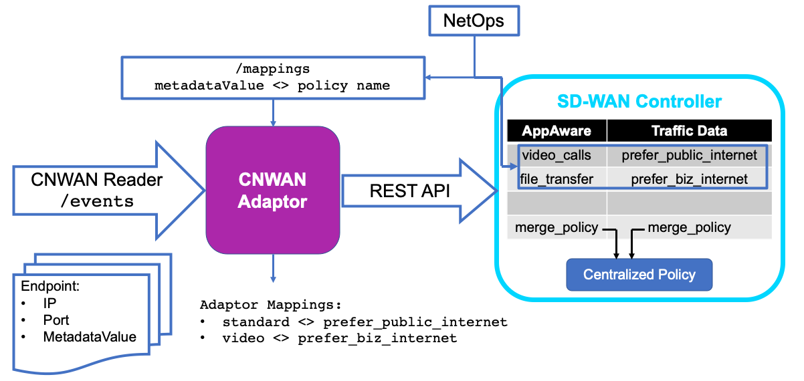

# CN-WAN Adaptor

The CN-WAN Adaptor is part of the Cloud Native SD-WAN (CN-WAN) project. Please check the [CN-WAN documentation](https://github.com/CloudNativeSDWAN/cnwan-docs) for the general project overview and architecture. You can contact the CN-WAN team at [cnwan@cisco.com](mailto:cnwan@cisco.com).

## Overview
This CN-WAN Adaptor takes as input several cloud parameters, such as endpoint IP and port, and associated metadata (e.g. traffic profiles), and sends them to a SD-WAN controller. The SD-WAN controller implements policies to steer traffic flows for these endpoints to the desired tunnel or apply a SLA on them. On its current iteration the CN-WAN Adaptor supports Viptela [vManage](https://developer.cisco.com/docs/sdwan/) as SD-WAN controller. The Adaptor needs valid credentials to connect to the API of the SD-WAN controller (user, password, and IP or domain name).

To see all the possible Adaptor API calls, run the Adaptor as a Docker container (see below) and type [http://localhost:80/ui/](http://localhost:80/ui/) in your browser (if exposing the Adaptor though a port other than 80 via Docker, use the appropiate port instead). In addition, the file [CN-WAN Adaptor.postman_collection.json](./CNWAN_Adaptor.postman_collection.json) contains a Postman collection with examples of all the API functions. In particular, the Adaptor provides the `/cnwan/events` API endpoint [http://localhost:80/cnwan/events](http://localhost:80/cnwan/events) for the CN-WAN Reader to send events.


## Requirements
* Docker Engine 19.03.8+
* Cisco vManage, tested against versions 20.3.1 (recommended) and 19.2.1.


## Usage
The adaptor runs in a Docker container:

```bash
# build the image
docker build -t cnwan_adaptor .

# starting up a container
docker run -p 80:8080 cnwan_adaptor
```

It is possible to specify the SD-WAN controller credentials through environment variables (instead of via the Adaptor API):

```bash
docker run -p 80:8080 \
-e SDWAN_IP=sample.server.com \
-e SDWAN_USERNAME=user \
-e SDWAN_PASSWORD=xxxxx \
-e MERGE_POLICY=merge_policy_name \
cnwan_adaptor
```

## Quickstart
If you want a minimal working setup, equivalent to the one used in the [CN-WAN demo](https://www.cisco.com/c/en/us/training-events/events/kubecon-europe.html#~demos-and-presentations) presented at KubeCon EU 2020, the script [examples/setup_kubecon_demo.sh](examples/setup_kubecon_demo.sh) sets everything up a for you in the adaptor and your SD-WAN controller. Before running it, please:

* Install the bash utility `jq`
* Take a look at the [policies_definition.json](examples/policies_definition.json) file and adapt it to your environment (tunnels, VPNs and deployment sites). The default values will re-create the values used in the KubeCon demo. You can add as many policies and SLAs as you need. In addition, specify the metadata keys and values used by the CN-WAN reader. In the KubeCon demo, these were "cnwan.io/traffic-profile=video" and  "cnwan.io/traffic-profile=standard".

## SD-WAN controller configuration


The adaptor supports both vManage [Application Aware Routing](https://www.cisco.com/c/en/us/td/docs/routers/sdwan/configuration/policies/vedge-20-x/policies-book/application-aware-routing.html) (e.g. for SLAs) and [Traffic Data](https://www.cisco.com/c/en/us/td/docs/routers/sdwan/configuration/policies/vedge-20-x/policies-book/data-policies.html) (e.g. to send traffic to a specific tunnel color) policies.

The adaptor requires the following configuration in vManage (the script [setup_kubecon_demo.sh](examples/setup_kubecon_demo.sh) automates this process):

1. Switch vSmart to vManage mode
2. Create two empty policies with the same name (use any name), one Application Aware Routing policy and another Traffic Data policy. Use the appropiate sections of Traffic Policy section (in the Custom Options section of vManage's Policy configuration) to create these policies. These will be used to merge all the different Application Aware Routing and Traffic Data policies that the Adaptor is going to populate.
3. Send the shared name of these empty policies to the adaptor in the `sdwanMergedPolicyName` variable in the `credentials` schema (`POST /credentials`). The empty policies will be used to merge all policies of each type into a single one per type.
4. Create a centralized policy referencing the previous two policies. Add to this centralized policy the sites and VPNs that need the  policies. This is the final policy that will be distributed in the SD-WAN fabric, which contains the merged Application Aware Routing and merged Traffic Data policies.
5. Create as many [Application Aware Routing](https://www.cisco.com/c/en/us/td/docs/routers/sdwan/configuration/policies/vedge-20-x/policies-book/application-aware-routing.html) and [Traffic Data](https://www.cisco.com/c/en/us/td/docs/routers/sdwan/configuration/policies/vedge-20-x/policies-book/data-policies.html) policies as needed by the user. The first allow applying a user-defined SLA to the flows, while the latter steer flows through a specific tunnel color. Leave empty the match part of these policies, since the Adaptor will take care of populating the match conditions based on the services learnt from the CN-WAN Reader.
    * The Traffic Data policies need a `Traffic Engineering` rule with an empty match and the action `Local TLOC`, specifying the desired color tunnel and encapsulation.
    * The Application Aware Routing policies need an `AppRoute` rule with an empty match and the action `SLA Class List` with the desired SLA class.
6. Linking the policies in vManage to the metadata values in the CN-WAN reader. Use the `POST /mappings` Adaptor API this way:
    * `metadataKey` is the key used in the CN-WAN reader
    * `metadataValue` is the value used in the CN-WAN reader
    * `policyName` is the name of one of the policies defined in step 3
    * `policyType` is `AppRoute` for an Application Aware Routing or `Data` for Traffic Data policies.
7. Note that the `metadataValue` to `policyName` mapping is 1:1 (two metadata values cannot share the same `policyName`). On the other hand, a single `metadataKey` supports any number of `metadataValue`.


## How it works



Internally, the adaptor works this way:
1. Configuration stage:
    1. NetOps define a `Centralized Policy` and apply it to the Sites and VPNs they need.
    2. NetOps define as many `AppAware` and `Traffic Data` policies as needed in the SD-WAN controller (these are merged and referenced by the `Centralized Policy`).
    3. NetOps bind these policies to the `metadataValue` in Service Directory using the `POST /mappings` API in the adaptor
2. The adaptor listens to events from the CN-WAN reader
3. When the adaptor receives a list of events from the Reader:
    1. Adds each endpoint to the appropriate policy using the previously defined mappings to locate the policy corresponding to each  `metadataValue`. Eg. an endpoint with `metadataValue = video` will be added to the `prefer_biz_internet` policy.  
    2. Copies all endpoints in all CN-WAN policies to the merge policy
    3. Triggers the process to update the device templates with the new configuration
    4. The `/events` API call supports adding, removing and updating endpoint information. 

## Other features

* **Live mapping update:** It is possible to issue a `PUT /mapping` at any moment, and the adaptor will move all endpoints from such mapping to the new policy and update accordingly. This feature also supports moving from `TrafficData` to `AppAware`, and viceversa.
* **NetOps-defined policies:** It is possible to add user-defined policies unrelated to the CN-WAN operations. Just add them as separate sequences in the merge policy. **WARNING!** Make sure the sequence name is *different* from the policy names used in the CN-WAN mappings, otherwise the adaptor will overwrite them with its data. The user-defined policies will be activated along with the CN-WAN endpoint sequences.


## More info


This adaptor was generated by the [swagger-codegen](https://github.com/swagger-api/swagger-codegen) project. By using the
[OpenAPI-Spec](https://github.com/swagger-api/swagger-core/wiki) from a remote server, you can easily generate a server stub.  This
is an example of building a swagger-enabled Flask server.
This example uses the [Connexion](https://github.com/zalando/connexion) library on top of Flask.


## Using the library without the server
It is possible to use the metadata_adaptor python library without the server. It exposes several high level functions equivalent to he ones in the adaptor. To use the library:

```bash
cd adaptor_library
# Generate the package
python3 setup.py sdist bdist_wheel
# Install the package
pip3 install requests
pip3 install dist/metadata_adaptor-2.0.0.tar.gz

# Use the library
python3
import metadata_adaptor.core_lib as sdwan
api = sdwan.api_endpoint()

# Example 1: configure controller credentials
cred = {
    "user": "XXXXXX",
    "password": "XXXXXX",
    "sdwanControllerIpAddress": "sample.server.com",
    "sdwanMergedPolicyName" : "your_merge_policy"
}
api.post_credentials(cred)

# Example 2: create a new mapping
mapping = {
    'metadataKey' : 'traffic-profile',
    'metadataValue' : 'nice_name_to_remember_your_mapping',
    'policyType' : 'Data',
    'policyName' : 'sample_policy_in_controller'
}
api.post_mapping(mapping)
```

You can find all the library functions in [core_lib.py](adaptor_library/metadata_adaptor/core_lib.py)
